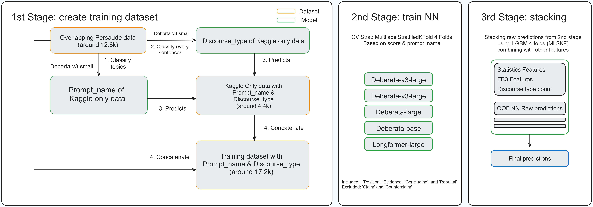
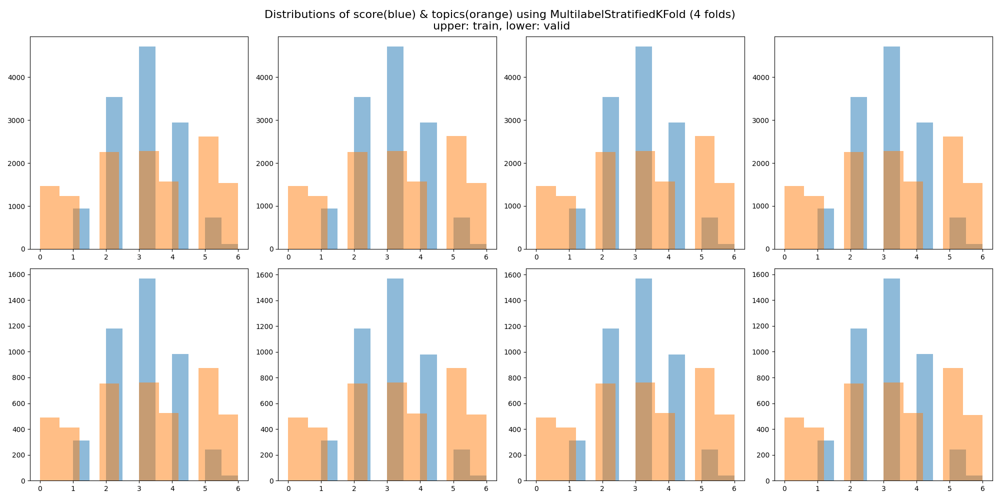
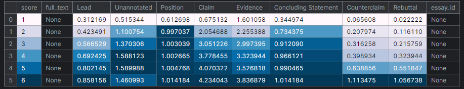
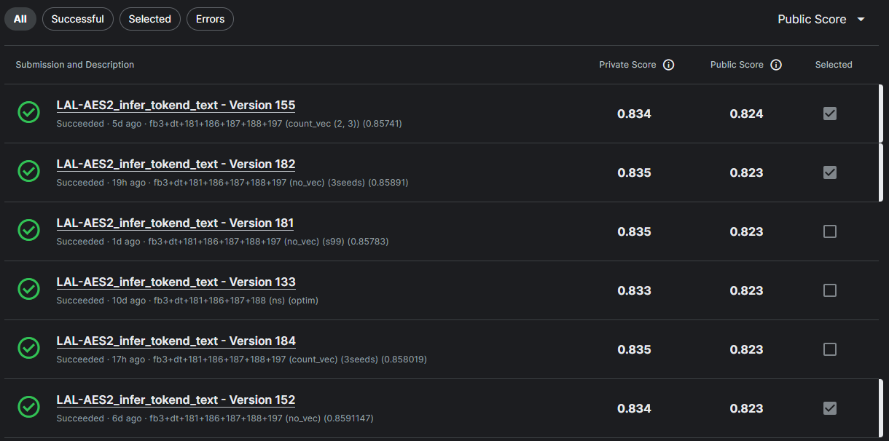
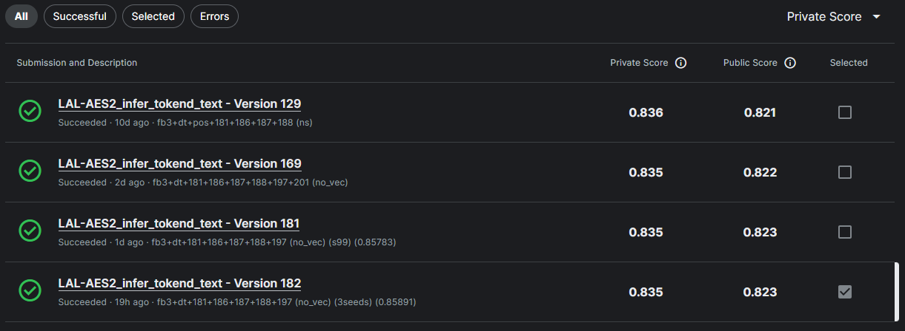

# 15th Place Solution

Firstly, I would like to thanks for hosting such a interesting and challenging competition, and every competitiors that has been kind for sharing their valuable discovers through their hard work.
This is my first solution write-up. If I missed anything, feel free to ask.

## Overview



## Summary

The most important key piece in the solution is utilizing annotated discourse type that was given in Persuade 2.0 corpus. I treated these discourse type as targets to train and predict each sentence the rest the of the essay that was not annotated and done some post-processing. Then, I added these predicted discourse type at the start of the correponding sentences. I believed this would enrich data and explicitly tell the specific role of the sentences in the essay to the model helping it understand structure of the essay and even number of arguments made in the essay. Every NN models was trained on this data. This gave a boost around 0.005-6 both on CV and LB for single model when comparing to default given essays. Lastly, LightGBM was trained with stacking NN models OOF predictions along with other features. Since the result of LightLGBM was a bit unstable, I decided to blend 3 different seeds only on model random_state.

## Discourse type

 First, I started with `[(DISCOURSE_TYPE)]` and added user-defined special tokens to tokenizer. Then, I realized that it might be better to use tokens (words) that model is already pretrained instead of using user-defined token that might hold different meaning when fine-tuning. To increase contrast from special token that was used in pretrained, `<>` was used instead of `[]`. So from `[LEAD]` to `<Lead>` or `[CONCLUDE]` to `<Concluding>`. Note that in the mapping process, there were a lot of edge cases needed to handle, most marks were correctly placed. However, there were some discourse type marks slightly misplaced from where it should be. Moreover, `Claim` and `Counterclaim` were excluded because it gave worse result when included them in the essay. I could not find evidence why it was the case. Thus, the decision was made on empirical experiment results. The possible theory is that those two are hard to predict than others hence it predicted more false positive than other marks.

Example,
```markdown
<Lead>I am a scientist at NASA that is discussing the "face" on mars. <Position>I will be explaining how the "face" is a land form. By sharing my information about this isue i will tell you just that.
<Claim>First off, how could it be a martions drawing. There is no plant life on mars as of rite ...
```

There are still room for improvement. For example, correctly placed discourse type marks, better solution to predcit discourse type (in this solution using 4 folds of DeBERTA-v3-small, in the earlier stage of developing the idea. It took around 1 hour in submission lonely just for predicting discourse type for 4 folds of small model and 1 hour for 1 fold of large model. Later, I found out that it was feeding 1 batch at the time (1 sentence at the time). Increasing batch size to 32 reduced inferencing time to just under 20 mins. However, it was too late to make any changes).

## Cross vaildation strategy

A significant amount of time was spent in the early stage of the competition finding a robust cross validation strategy. I started by simple `StratifiedKFold` followed by `GroupKFold` and `StratifiedGroupKFold`. However, consistency could not be observed across the folds. I ended up using `MultilabelStratifiedKFold` based on score and prompt_name, splits to 4 folds. (Prompt_name was also train using persuade 2.0 corpus). This allowed every folds exposed to score and prompt_name (topics) equally as I found that the model will perform poorly on unseen topics. I took conservative path as hidden test dataset could contain unseen topics. Through the end of the competition, I could not find close correlation between local CV and LB. The direction of experimenting was moving toward the path when local CV and LB improvement is observed in the same trend and similar range.



## Modeling

| Model No. | Architecture          | Pooling Layer     | Max Length | CV      | Public | Private |
|-----------|-----------------------|-------------------|------------|---------|--------|---------|
| exp181    | DeBERTa-v3-Large      | Mean Pooling      | 2048       | 0.84362 | 0.802  | 0.816   |
| exp186    | DeBERTa-Large         | Mean Pooling      | 2048       | 0.84839 | 0.797  | 0.816   |
| exp187    | DeBERTa-v3-Large      | GeM Pooling       | 2048       | 0.84523 | 0.799  | 0.820   |
| exp188    | Longformer-large-4096 | Mean Pooling      | 2048       | 0.83610 | 0.798  | 0.815   |
| exp197    | DeBERTa-Base          | Attention Pooling | 1024       | 0.83633 | 0.804  | 0.818   |
| stacking  | LightGBM              | -                 | -          | 0.85891 | 0.823  | 0.835   |

These 3 architectures are the most effective in the solution. I also tried bigbird-roberta-large and funnel-large. However, both did not help improving both on local CV and LB when stacking. They were not included. For pooling layer, Mean pooling and GeM pooling were performing the best in my local CV, Attention Pooling was added to increase variation.
I used similar hyperparameter  across all models

- Layer-wise learning rate decay
- lr: 1e-5
- no warmup
- epoch: 3
- batch size: 8
- gradient cliping: 1.0

## Features

For features engineering, statistical information about essay similar to public notebook was used. I studied the notebook line-by-line, modified some parts and turn Pandas to Polars for faster processing. `pyspellchecker` was used to count spelling errors (this is a bit different or at least more correct than using txt in the public notebook).
When I was exploring Persuade corpus, I observed particular trend about number of discourse type. This discovery help us come up with the idea how can we ulitizing these things.
The tables below shows mean of number of discourse type in each score.




Feature from the past competition was also utilized. ([Feedback Prize - English Language Learning](https://www.kaggle.com/c/feedback-prize-english-language-learning)). I took [Team turing's (1st place efficiency prize)](https://www.kaggle.com/competitions/feedback-prize-english-language-learning/discussion/369646) model, which help improve on both local CV and LB. I would like to thank you to their phenomenal works
Please consider to give them an upvote.

## Final Submission selection

I would like to share my local CV vs LB submissions roller coaster experience.
My current rank is my second best LB score and second best CV. I chose 0.824 just in case public notebook remained at the top, so I won't get kicked down more than 700+ rank down. Meanwhile, my best Private score submitssion was slightly lower both in local CV and LB so I did not select it.



  


## What worked

- layer-wise learning rate decay with low learning rate
- last layer weights initialization
- MultilabelStratifiedKFold based on topics & score (4 folds)
- discourse type injection (Position, Evidence, Rebuttal, Concluding Statement)

## What did not work

- Adversarial training (AWP, SiFt)
- Weighted Averaging (EMA)
- pretrained MLM
- predicting discourse type using MLM
- stacking Regression models together with Classification model
- train multi-task
- added assigment at the start of the essay

## Importance Citation & Special Thanks

- [Team turing's (1st place efficiency prize)](https://www.kaggle.com/competitions/feedback-prize-english-language-learning/discussion/369646) 
- Public Notebook (I lost track who was the original creator of the features. I think I studied the features from [this notebook](https://www.kaggle.com/code/siddhvr/aes-2-0-deberta-lgbm-baseline#Preprocessing) @siddhvr)


